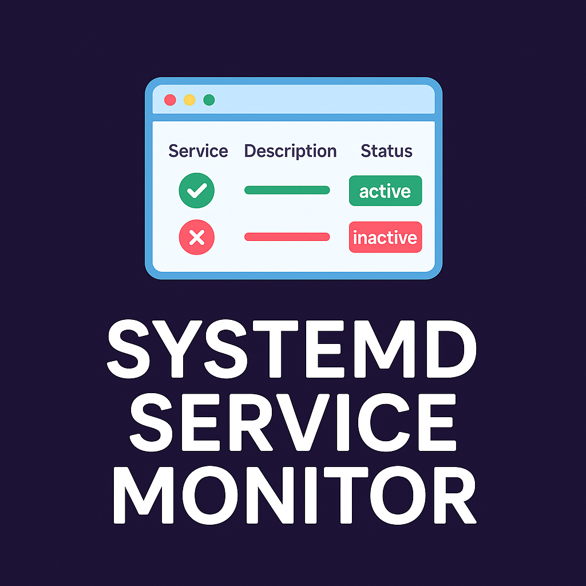

# SystemD Services Monitor

A modern, beautiful web-based dashboard for monitoring and controlling systemd services with a warm, friendly design.



## Features

- **Real-time Monitoring** - View all systemd services with auto-refresh every 5 seconds
- **Service Control** - Start, stop, and restart services with a single click
- **Status Filtering** - Filter services by status (All, Active, Inactive, Failed)
- **Search Functionality** - Quickly find services by name
- **Beautiful UI** - Modern design with warm colors and smooth animations
- **Responsive Design** - Works perfectly on desktop and mobile devices

## Prerequisites

- Python 3.6+
- Flask
- A Linux system with systemd
- Sudo privileges for controlling services

## Quick Start

### 1. Install Python Dependencies

```bash
pip3 install -r requirements.txt
```

### 2. Setup Sudo Permissions (REQUIRED)

To control services (start/stop/restart), you need to configure sudo permissions:

```bash
chmod +x setup-sudo.sh
./setup-sudo.sh
```

This script will:
- Create a sudoers configuration file
- Allow your user to run systemctl commands without a password
- Test the configuration

**Important**: After running the setup script, you may need to log out and log back in for the changes to take effect.

### 3. Start the Application

#### Option A: Flask Backend Only (Production)

```bash
python3 app.py
```

Then open your browser to: `http://localhost:5000`

#### Option B: Development Mode (React + Flask)

**Terminal 1 - Flask Backend:**
```bash
python3 app.py
```

**Terminal 2 - React Frontend:**
```bash
npm install
npm run dev
```

Then open your browser to: `http://localhost:5173`

## Manual Sudo Configuration

If you prefer to configure sudo manually instead of using the setup script:

1. Create a sudoers file:
```bash
sudo visudo -f /etc/sudoers.d/systemd-monitor
```

2. Add these lines (replace `YOUR_USERNAME` with your actual username):
```
YOUR_USERNAME ALL=(ALL) NOPASSWD: /usr/bin/systemctl start *
YOUR_USERNAME ALL=(ALL) NOPASSWD: /usr/bin/systemctl stop *
YOUR_USERNAME ALL=(ALL) NOPASSWD: /usr/bin/systemctl restart *
YOUR_USERNAME ALL=(ALL) NOPASSWD: /usr/bin/systemctl status *
```

3. Save and exit (Ctrl+X, then Y, then Enter)

4. Verify the configuration:
```bash
sudo -n systemctl status ssh.service
```

If this command runs without asking for a password, you're all set!

## Usage

### Viewing Services

- All services are displayed in a table with their status, description, and state
- Services are automatically refreshed every 5 seconds
- Use the search bar to filter services by name
- Click on the status tabs to filter by: All, Active, Inactive, or Failed

### Controlling Services

- **Active services**: You can Stop or Restart them
- **Inactive/Failed services**: You can Start or Restart them
- Click the action button and wait for the operation to complete
- A notification will confirm success or show any errors

### Status Indicators

- 🟢 **Active** (Green) - Service is running normally
- 🟡 **Inactive** (Yellow) - Service is not running
- 🔴 **Failed** (Red) - Service has failed

## Troubleshooting

### Permission Denied Errors

If you get "Permission denied" errors when trying to control services:

1. Make sure you ran the `setup-sudo.sh` script
2. Log out and log back in to refresh your sudo permissions
3. Test sudo access: `sudo -n systemctl status ssh.service`
4. If still not working, check `/etc/sudoers.d/systemd-monitor` exists and has correct permissions

### Flask Backend Not Responding

If the React frontend shows "Flask backend is not running":

1. Make sure Flask is running: `python3 app.py`
2. Check that port 5000 is not in use: `lsof -i :5000`
3. Verify Flask is listening on all interfaces: check the console output

### Build Issues

If you encounter build issues:

```bash
npm install
npm run build
```

## Production Deployment

For production deployment, see [DEPLOYMENT.md](DEPLOYMENT.md) for instructions on:
- Setting up as a systemd service
- Configuring Nginx as a reverse proxy
- Running with Gunicorn

## Security Notes

- The sudo configuration is limited to specific systemctl commands only
- No password is stored or transmitted
- Service control requires running the application under a user with sudo privileges
- Always review sudoers configurations before applying them

## Project Structure

```
├── app.py                  # Flask backend application
├── setup-sudo.sh          # Sudo configuration script
├── requirements.txt       # Python dependencies
├── package.json           # Node.js dependencies
├── src/                   # React frontend source
│   ├── components/       # React components
│   ├── hooks/           # Custom React hooks
│   ├── services/        # API service layer
│   └── types/           # TypeScript type definitions
├── static/               # Static assets
└── dist/                # Production build output
```

## License

MIT License - feel free to use this project for your own purposes.

## Contributing

Contributions are welcome! Please feel free to submit a Pull Request.
